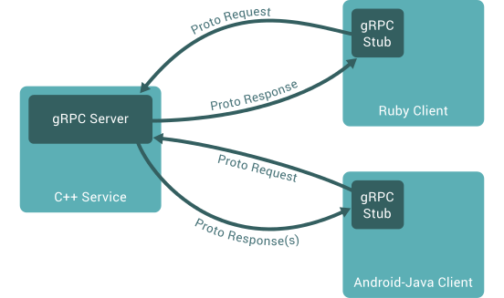

# 

gRPC est un framework open source RPC (remote call procedure) basé sur HTTP/2, initialement dévéloppé par Google. 
Ce dernier facilite la création d'APIs performantes et scalables dans un nombre important de langages. 



Dans cette article nous verrons comment mettre en oeuvre une API à l'aide de gRPC, Protobuf et Go. 

## L'interface : Protocol Buffers

Définition officielle : 
> "Protocol buffers are Google's language-neutral, platform-neutral, extensible mechanism for serializing structured data."

Pour résumer, Protocol Buffer ou Protobuf permet d'encoder/décoder des données dans un format universel dans le but d'en profiter facilement dans différents langages. 
Tout cela en assurant un grande capacité d'échange sans surcharger le réseau. 

Techniquement, Protobuf sérialise les données en binaire et fourni les outils pour encoder et décoder les messages.

Pour un complément d'information, notament sur les langages supportés par Protobuf: https://github.com/protocolbuffers/protobuf

### Mise en place

#### Pré-requis 
 
Avoir l'environnement Go est installé et configuré. 
Si cela n'est pas le cas : https://golang.org/dl/

#### protoc

Cette librairie va founir l'outil `protoc` qui va nous permettre de générer le client/serveur de notre future API.

```sh
    $ go get -u github.com/golang/protobuf/protoc-gen-go
```

### La pratique : My car factory 🏎

Voici l'ébauche d'un service qui permet de créer des voitures, et de lister les véhicules créés. 

```proto
syntax = "proto3"; 
package car;

message Car {
  string identifier = 1;
  string name = 2;
}

message CreateCarRequest {
  string name = 1;
  enum Color {
    BLACK = 0;
    WHITE = 1;
    RED = 2;
  }
  Color color = 2;
  bool cooler = 3;
}

message CreateCarResponse {
  string identifier = 1;
}

message ListCarRequest {
  bool cooler = 1;
}

message ListCarResponse {
  repeated Car cars = 1;
}

service Factory {
  rpc Build(CreateCarRequest) returns (CreateCarResponse);
  rpc List(ListCarRequest) returns (ListCarResponse);
}
```

Les premières lignes du fichier `.proto` permettent de définir le protocol utilisé ainsi que de déclarer le package. 
*Dans le cas du Go, il s'agit du package go.*

Les déclarations `message` définissent les données qui vont être sérialisées et échangées sur le réseau. 
Les `= 1`,`= 2` sont appelés `tags` et sont utilisés par les champs une fois encodé. 

En `proto3`, si l'un des champs n'est pas explicitement renseigné, il prend alors sa valeur par défaut. 
*Soit en Go: 0 pour les valeurs numériques, "" pour les chaînes vides, et false pour les booléens.*


Et pour finir, la partie `service` expose les opérations de l'API

### Generate!

Voici la commande pour générer le code go à partir de la déclaration protobuf :

```sh
    $ protoc -I=$SRC_DIR --go_out=$DST_DIR $SRC_DIR/*.proto
```

Dans notre cas, voici la commande à executer : 

```sh
    $ protoc -I=car --go_out=plugins=grpc:car ./car/*.proto
```

Il est interessant de noter qu'on ajoute `plugins=grpc` à notre compilation. Cela va générer un code Go compatible avec 
gRPC.

## Go

### Serveur

Implémentation basique coté serveur: 


```go
...
const port = ":51001"

type server struct{}

func (s server) Build(ctx context.Context, req *car.CreateCarRequest) (*car.CreateCarResponse, error) {
	return &car.CreateCarResponse{...}, nil
}

func (s server) List(ctx context.Context, req *car.ListCarRequest) (*car.ListCarResponse, error) {
	return &car.ListCarResponse{...}, nil
}

func main() {
	lis, err := net.Listen("tcp", port)
	if err != nil {
		log.Fatalf("failed to listen: %v", err)
	}

	s := grpc.NewServer()
	car.RegisterFactoryServer(s, &server{})

	if err := s.Serve(lis); err != nil {
		log.Fatalf("failed to serve: %v", err)
	}
}
```

Démarrer le server :
```sh
    $ go run server/main.go
```

### Client

Implémentation basique coté client :
```go
...
const address = ":51001"

func main() {

	// Set up a connection to the server.
	conn, err := grpc.Dial(address, grpc.WithInsecure())
	if err != nil {
		log.Fatalf("did not connect: %v", err)
	}
	defer conn.Close()
	client := car.NewFactoryClient(conn)

	// timeout
	ctx, cancel := context.WithTimeout(context.Background(), time.Second)
	defer cancel()

	resp, err := client.Build(ctx, &car.CreateCarRequest{Name: "Audi A3", Color: car.CreateCarRequest_BLACK, Cooler: true})
	if err != nil {
		log.Fatalf("Building car err: %+v", err)
	}
	log.Infof("Car: %v", resp)
}
```

Executer le client :
```sh
    $ go run client/main.go
```

## "Go further"

### Timeout / Deadline

gRPC assure aussi la gestion de "deadline". Cela permet au client gRPC de définir le temps qu'il souhaite attendre la 
réponse du serveur. En cas de dépassement de cette "deadline", l'appel RPC se termine avec l'erreur `DEADLINE_EXCEEDED`.

Exemple de deadline :
```go
    deadline := time.Now().Add(500*time.Millisecond)
    ctx, cancel := context.WithDeadline(ctx, deadline)
```

Et au format timeout :
```go
    ctx, cancel := context.WithTimeout(context.Background(), 5*time.Second)
```

### Errors

gRPC dispose d'une liste d'erreurs standardisées, à l'instar des codes status HTTP :
```go 
st := status.New(codes.ResourceExhausted, "Request limit exceeded.")
return nil, st.Err()
```

Il est aussi possible d'ajouter du détail à cette erreur :
```go
    ds, err := st.WithDetails(...)
    if err != nil {
        return nil, st.Err()
    }
    return nil, ds.Err()
```

Voici la liste des erreurs gRPC : https://github.com/grpc/grpc/blob/master/doc/statuscodes.md

### Stream

Dans la réalité, gRPC permet de définir 4 types de méthode de service: 
unary, client streaming, server streaming et bidirectional streaming.

Dans nos exemples, on a vu le cas le plus courant: "unary" qui permet de réaliser un appel normal avec une réponse pour 
une requête.

Voici la liste des services de streaming à disposition :
* `server streaming` permet d'obtenir une réponse sous format de flux pour un appel
```go
    rpc ServerStream(Request) returns (stream Response) {}
```

* `client streaming` permet d'envoyer une séquence de messages à travers un flux. Une fois que le client a fini d'écrire 
les messages, il attend la réponse du serveur.
```go
    rpc ClientStream(stream Request) returns (Response) {}
```

* `bidirectional streaming` permet le mixte des deux précédents, avec un flux en écriture et un en lecture.
```go
    rpc Bidirectional(stream Request) returns (stream Response){}
```

## Conclusion 

En résumé, protobuf offre :
* un support multi langage ;
* un mécanisme pour sérialiser/déserialiser ;
* des interfaces pour des services RPC ;
* un typage et une validation des champs ;
* moins de boilerplate code à l'utilisation !

Couplé à gRPC on obtient :
* performance et robutesse ;
* une facilité à "scale" ;
* duplex streaming ;
* un code auto-généré.

gRPC est une alternative sérieuse à opposer à REST. Notamment pour définir une API entre services, robuste, performante 
et simple à mettre en oeuvre. 
Cependant, les développements front-end semblent plus laborieux à mettre en oeuvre, 
mais pas impossibles : https://grpc.io/blog/state-of-grpc-web.


Liens utiles : <br>
https://grpc.io/blog <br>
https://github.com/grpc/grpc-go/tree/master/examples/features <br>
https://github.com/grpc-ecosystem/go-grpc-middleware/ <br>
